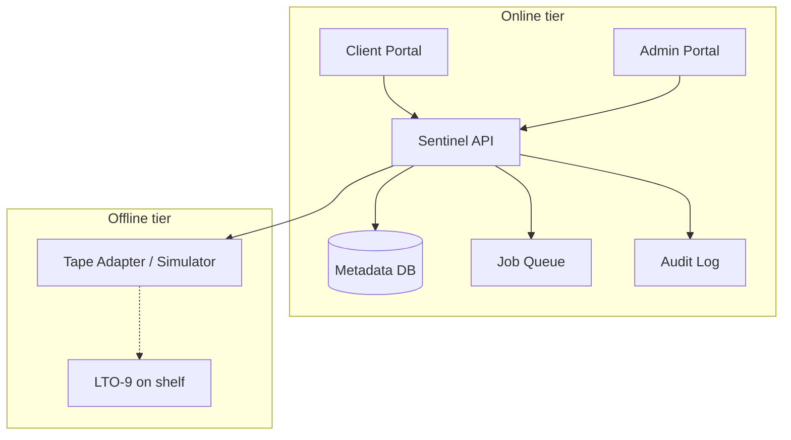

# BioVault Sentinel — Phase 1 Knowledge Transfer

**Project:** BioVault (Sentinel)  
**Document:** Knowledge Transfer — Phase 1: Managed Archival Vault  
**Audience:** Product, engineering, and operations

> **One sentence:** Phase 1 is a high-security offline data vault in Hyderabad where organisations store old records on magnetic tapes to remain legally compliant and protected from cyber threats, managed through a simple web dashboard.

---

## Table of contents

1. [What we are building](#1-what-we-are-building)
2. [Why this exists — compliance](#2-why-this-exists--the-compliance-problem)
3. [How Phase 1 works](#3-how-phase-1-works--the-full-picture)
4. [Business model](#4-business-model)
5. [Dashboard — technical overview](#5-dashboard--technical-overview-for-the-team)
6. [What success looks like](#6-what-success-looks-like--phase-1-goals)
7. [Glossary](#7-glossary-of-key-terms)
8. [Engineering execution plan](#8-engineering-execution-plan)

---

## 1. What we are building

Project Sentinel is a managed data archival service aimed at hospitals, clinics, pharmaceutical companies, financial institutions, legal firms, and enterprises in India. The core idea is simple: we help organizations store their old, legally required data in a way that is **secure, offline, searchable, and compliant** with Indian law.

We are **not** building another cloud storage platform. We are building a **physical, offline, air-gapped** archival vault backed by a smart management dashboard — the **Sentinel Dashboard** — that gives clients full visibility and control over their archived data without exposing it to internet-connected risks.

---

## 2. Why this exists — the compliance problem

### 2.1 The legal context: DPDPA 2023

India's Digital Personal Data Protection Act (DPDPA) 2023 is in a critical enforcement phase as of May 2026. This law creates obligations that our target customers — hospitals, clinics, diagnostic labs, pharma companies, and enterprises — must meet or face significant penalties.

| Legal obligation | What it means for our customers |
| ---------------- | ------------------------------- |
| Minimum data retention | Certain categories of data must be stored for at least 1 year; often longer for healthcare records. |
| Reasonable safeguards | Companies must protect stored data with security measures appropriate to sensitivity. |
| Right to Erasure | When a user requests deletion of personal data, the company must prove it was actually deleted. |
| Audit readiness | Companies must produce compliance records and evidence of data handling practices. |
| Penalty for non-compliance | Fines of up to ₹250 Crore for serious breaches. |

### 2.2 The gap in the market

Most organisations in India handle archival data inadequately in one of three ways:

- **On-premise servers** — vulnerable to fire, hardware failure, ransomware, and theft.
- **Cloud storage (AWS, Azure, Google)** — high unpredictable egress fees on retrieval; data sovereignty concerns.
- **No formal archival** — increasingly risky as DPDPA enforcement ramps up.

Sentinel Phase 1 fills this gap: physically safer than on-premise, cheaper than cloud for long-term archival, and purpose-built for compliance.

---

## 3. How Phase 1 works — the full picture

### 3.1 The physical storage layer: LTO-9 magnetic tape

The foundation of Phase 1 is **LTO-9** (Linear Tape-Open, Generation 9) magnetic tape — enterprise-proven technology for long-term archival.

| Property | Detail |
| -------- | ------ |
| Native capacity per tape | 18 TB (up to 45 TB compressed) |
| Data lifespan | 30+ years in controlled conditions |
| Cost per GB | Significantly lower than cloud cold storage for long-term archival |
| Security model | Air-gapped — physically offline, unreachable by network attackers |
| Reliability | High — sequential media, low mechanical failure rate |

#### What “air-gapped” means

An **air gap** is a physical separation between stored data and any network connection. Once data is written to tape, the cartridge is removed from the drive and placed on a shelf. A remote attacker cannot reach it because it is not connected to anything. This is categorically different from cloud or on-premise server storage.

### 3.2 The facility: co-location, not construction

We do not build our own data centre. We lease space inside an existing **Tier-4** certified facility in Hyderabad (e.g. CtrlS).

**What the colo provides**

- 24/7 physical security (guards, biometric access)
- Redundant power (UPS, diesel generators)
- Climate control for tape longevity
- Fire suppression rated for electronic media
- Racks, cabling, cooling

**What we provide**

- LTO-9 drives, libraries, and media
- Sentinel Dashboard (software intelligence)
- Tape management, cataloguing, retrieval operations
- Compliance layer: audit certificates and deletion proofs

We pay for rack space and power — not construction, guards, or fire suppression. This keeps capital requirements low for early customers.

### 3.3 The dashboard — our core product

The dashboard transforms “blind” tape storage into a managed service clients can use daily. Without it, a tape is only a barcode-labelled cartridge; the customer cannot know what is on which tape without loading each one manually.

| Feature | Description and purpose |
| ------- | ------------------------ |
| Tape catalogue & index | Every ingested file is indexed (filename, type, date, client ID, category, physical location). Index lives in the database, not on tape. |
| Search engine | Clients search by metadata (name, date range, type, department, etc.). Results come from the index without touching tape. |
| File request & retrieval | “Request File” creates a retrieval job; technician (or robot) loads the correct tape. Target SLA: **15 minutes** to delivery. |
| Retrieval delivery | File copied to a temporary secure server; time-limited download link; purged after download. |
| Tape health monitoring | Age and read/write cycles tracked; alerts before end-of-life; re-copy before degradation. |
| Compliance certificates | DPDPA Right to Erasure → cryptographically signed certificate that data was permanently wiped. |
| Client dashboard & reports | Storage volume, tapes used, cost breakdown, renewals, retrieval history, compliance status. |

### 3.4 The data ingestion process

Standard ingest flow:

1. **Client data preparation** — Package per ingest spec (format, folder structure, naming); may include migration from legacy systems.
2. **Secure transfer** — Encrypted SFTP or physical courier for large initial migrations; no unnecessary retention in transit.
3. **Indexing** — Metadata into Sentinel DB; SHA-256 checksum per file.
4. **Write to tape** — LTO-9 write; barcode and slot recorded against indexed files.
5. **Verification** — Read-back confirms checksum; tape marked `live` only after pass.
6. **Shelf storage** — Cartridge removed, labelled, racked; drive free for next job.
7. **Client confirmation** — Ingest report in dashboard: files received, tape locations, contract start date.

---

## 4. Business model

### 4.1 Pricing structure

Phase 1 uses **monthly subscription** by stored volume and service tier. Predictable pricing vs cloud egress surprises; flat rate includes bundled retrievals.

| Revenue component | How it works |
| ----------------- | ------------ |
| Monthly storage fee | Per TB; covers media amortisation, rack, climate share, ops overhead. |
| Retrieval bundle | Tier includes N retrievals/month (technician + temporary delivery server). |
| Excess retrieval fee | Per retrieval beyond bundle — encourages store-often, retrieve-rarely. |
| Compliance certificate fee | DPDPA deletion/audit certs; included in higher tiers or per-cert in base. |
| Initial ingest fee (one-time) | First large migration: engineering, hardware, verification. |

### 4.2 Target customer profile

Phase 1 focus: Hyderabad and surrounding region; expand to other Indian metros.

- Private hospitals and chains — patient records, imaging (MRI, CT, X-ray), lab reports.
- Diagnostic centres and imaging labs — DICOM and reports.
- Pharmaceutical companies — trials, regulatory submissions, batch records.
- Fintech and NBFCs — transactions, KYC, loan files under DPDPA.
- Mid-to-large enterprises — HR, financial archives, legal documents.

---

## 5. Dashboard — technical overview for the team

This section is for engineering and product building and operating the Sentinel Dashboard.

### 5.1 System architecture overview

| Layer | What it does |
| ----- | ------------ |
| Client portal (frontend) | Search, request, manage archived data; responsive, minimal training. |
| Admin portal (frontend) | Ops: tapes, locations, retrieval jobs, compliance reports. |
| API layer (backend) | REST for both portals: auth, search, jobs, notifications, certificates. |
| Metadata database | Index of every ingested file — heart of the system. |
| Job queue | Async ingest/retrieval jobs; technician assignment; SLA timer. |
| Tape management module | Tape lifecycle, health scores, re-copy alerts. |
| Notification service | Email/SMS: retrieval ready, SLA warnings, tape health, certificates. |
| Certificate engine | Signed PDFs for deletion, audit, ingest summaries. |

### 5.2 Key technical constraints

**Security**

- Metadata DB is internet-accessible (powers client portal).
- Tapes are **never** internet-accessible.
- Strict separation: online index vs offline data.
- No file content on the public-facing server — only metadata and temporary signed retrieval links.

**SLA**

- 15-minute retrieval is a product commitment.
- Alert within **60 seconds** if a retrieval job is unassigned.
- Technician UI must show unambiguous tape location.
- SLA timer visible on admin and client dashboards.

**Audit trail**

- Every action (ingest, search, retrieval request/complete, deletion) logged with timestamp, user ID, IP.
- Immutable log → basis for compliance certificates.

### 5.3 Phase 1 dashboard deliverables

Full set required for Phase 1 to be saleable:

**Deliverable 1: Client authentication & onboarding**

- Secure login with MFA for all client users
- RBAC: admin, read-only viewer, compliance officer per client account
- Onboarding wizard: client details, data categories, retention, ingest specification

**Deliverable 2: File ingestion pipeline**

- SFTP endpoint for secure transfer
- Automated metadata extraction (filename, size, type, date modified)
- SHA-256 per file
- Tape write scheduling and fill tracking
- Post-write checksum verification
- Ingest confirmation report in client portal

**Deliverable 3: Search & retrieval interface**

- Full-text and filtered search on client-owned index
- Search by filename, date range, file type, category, metadata keywords
- Admin sees tape barcode, rack, slot; **client does not**
- “Request File” → retrieval job
- Client retrieval tracker with status and ETA

**Deliverable 4: Operations & job management (admin portal)**

- Live job queue with SLA countdown
- Technician task view: barcode, rack, slot, load/copy steps
- Complete workflow → download link + client notification
- Tape inventory: status, location, fill %, age

**Deliverable 5: Tape health & lifecycle**

- Tape age and read/write cycle tracking
- Health score: green / amber / red
- End-of-life alerts → re-copy job
- Re-copy workflow with automatic index update

**Deliverable 6: Compliance & certificate module**

- Erasure workflow: locate tapes containing subject data
- Deletion confirmation: degauss/destroy, confirmed in system
- Signed PDF: client, subject ID, files deleted, timestamp, technician ID
- Audit log export for regulators

**Deliverable 7: Client billing dashboard**

- Monthly storage TB by category
- Retrieval count vs bundle
- Invoice history and preview
- Savings vs cloud comparison tool

---

## 6. What success looks like — Phase 1 goals

Phase 1 proves the product works, customers pay, and operations are reliable.

### 6.1 Product goals

| Goal | Definition of done |
| ---- | ------------------- |
| Dashboard live and stable | All 7 deliverables (§5.3) built, tested, in production. |
| Ingest pipeline reliable | SFTP ingest → tape with verified checksums in &lt;24h for normal volumes. |
| 15-minute retrieval SLA | 95% of jobs complete with download link within 15 minutes. |
| Compliance certificates valid | Deletion/audit certs signed; accepted in at least one client audit. |
| Tape health proactive | No data loss from degradation; re-copy before health reaches red. |

### 6.2 Business goals

| Goal | Target |
| ---- | ------ |
| First paying clients | Minimum 3 onboarded and actively storing data. |
| MRR | Positive operating cash flow from subscriptions. |
| Client retention | Zero churn in Phase 1. |
| Compliance positioning | Known compliance partner in Hyderabad healthcare/pharma. |

### 6.3 Operational goals

- Facility operational: rack leased, tape hardware tested, ingest workstation ready.
- Runbooks for ingest, retrieval, tape swap, deletion.
- Disaster recovery: at least one full restore-from-tape test.
- Team cross-trained — no single point of failure in ops or codebase.

---

## 7. Glossary of key terms

| Term | Definition |
| ---- | ---------- |
| LTO-9 | Linear Tape-Open Generation 9; ~18 TB native per cartridge. |
| Air-gap | Physical isolation from networks; tape on shelf cannot be hacked remotely. |
| Tier-4 data centre | Highest DC tier; 99.995% uptime, redundant power/cooling/security. |
| DPDPA 2023 | India's Digital Personal Data Protection Act. |
| Right to Erasure | Individual may request deletion; org must prove compliance. |
| Egress fee | Cloud charge for downloading/transfers out — hidden archival cost. |
| Checksum (SHA-256) | Cryptographic file fingerprint; verifies tape write integrity. |
| Ingest | Receive → index → write tape → verify. |
| Retrieval | Locate on tape → load → copy → deliver to client. |
| Degaussing | Magnetic erasure of tape media for secure deletion. |
| MRR | Monthly Recurring Revenue from subscriptions. |
| SLA | Contractual service standard; ours includes 15-minute retrieval. |
| Co-location (colo) | Lease space/power/cooling in a third-party data centre. |

---

## 8. Engineering execution plan

This section maps the KT to the `biovault-sentinel` monorepo and the solo **14-day MVP sprint**. Full product/compliance wording above; implementation details below.

### North star

| Build | Do not build |
| ----- | ------------ |
| Sentinel Dashboard (client + admin) | DNA codec / AGCT storage |
| Metadata DB (online index only) | File content on public API hosts |
| Ingest → checksum → tape write → verify | Wet-lab / biotech encoding |
| Search + retrieval + 15m SLA | Full robotic picker (human technician MVP) |
| Audit log + signed PDF certificates | HIPAA certification |
| Tape simulator + `TapeLibraryAdapter` | Owning a Tier-4 DC (colo only) |
| DPDPA erasure **workflow stubs** | Production MFA vendor (stub OK for MVP) |

**Critical constraint:** API and portals handle **metadata and jobs only**. Retrieved files use `STAGING_PATH` (temporary workstation), then purge after download.

### Architecture (online vs offline)



### Repository layout

```
biovault-sentinel/
  .cursorrules
  .cursor/rules/
  docs/
    KT-phase1.md
    daily/                 # 6pm review logs
    runbooks/
  packages/
    contracts/             # OpenAPI → TypeScript
    common/
  services/
    sentinel-api/
      src/modules/         # auth, clients, ingest, search, jobs, tapes, retrieval, certificates, audit, notifications
      src/tape/            # TapeLibraryAdapter + simulator
  apps/
    client-portal/
    admin-portal/
  deploy/
    docker-compose.yml
    .env.example
  tests/e2e/
```

**Phase 1 = modular monolith** (one API service). Split services only when ops scale requires it.

### Data model (MongoDB — metadata only)

| Collection | Purpose |
| ---------- | ------- |
| `clients` | Tenant, tier, retention policy |
| `users` | Login, role, `clientId`, MFA flag |
| `files` | Filename, type, category, `checksumSha256`, `clientId`, `ingestJobId`, keyword metadata |
| `tapes` | `barcode`, `rack`, `slot`, `status`, `fillPercent`, `healthScore`, `writeCycles`, `sealedAt` |
| `file_locations` | `fileId` → `tapeBarcode`, block/offset (internal) |
| `ingest_jobs` | received → indexing → writing → verifying → sealed |
| `retrieval_jobs` | `dueAt`, status, assignee, `downloadToken` expiry |
| `audit_events` | Append-only; payload hash chain |
| `certificates` | Type, `clientId`, PDF ref, `issuedAt` |

**Visibility:** Client search shows filename, date, category, status — **not** barcode, rack, or slot.

### Tape layer

```typescript
interface TapeLibraryAdapter {
  listDrives(): Promise<DriveState[]>;
  mount(barcode: string): Promise<void>;
  unmount(barcode: string): Promise<void>;
  writeSequential(barcode: string, stream: Readable): Promise<WriteResult>;
  readSequential(barcode: string, locator: FileLocator): Promise<Readable>;
}
```

- **MVP:** `services/sentinel-api/src/tape/simulator.ts`
- **Production:** `TAPE_ADAPTER=sim|mtx|scalar`
- Post-write: SHA-256 read-back must match index before `tapes.status = live`

### Deliverables → sprint map

| # | Deliverable | 2-week MVP (days) | Phase 1 completion (backlog) |
| - | ----------- | ----------------- | ------------------------------ |
| 1 | Auth & onboarding | D2 RBAC; stub onboarding | Full MFA, wizard, ingest spec generator |
| 2 | Ingestion pipeline | D3–D5 upload/SFTP stub, verify, report | Production SFTP, &lt;24h SLA metrics |
| 3 | Search & retrieval UI | D6–D7, D12 client UI | Keyword enrichment, bundle limits |
| 4 | Admin ops & jobs | D8–D9, D13 admin UI | SMS/email, runbook in UI |
| 5 | Tape health | D10 inventory + health colors | Automated re-copy jobs |
| 6 | Compliance & certificates | D11 audit + PDF sign | Full erasure, degauss, audit export |
| 7 | Billing dashboard | — | Usage TB, invoices, cloud comparison |

### 14-day calendar

| Day | Focus | Done when (6pm) |
| --- | ----- | ---------------- |
| **1** | Foundation | Repo boots; Compose API+Mongo+Redis; OpenAPI stub; schemas |
| **2** | Deliverable 1 | JWT/session auth; roles on routes |
| **3** | Deliverable 2a | Ingest intake; per-file SHA-256; `files` collection |
| **4** | Deliverable 2b | Tape sim write; `file_locations` + barcode/slot |
| **5** | Deliverable 2c | Read-back verify; job `sealed`; ingest report API |
| **6** | Deliverable 3a | Search filters (filename, date, type, category) |
| **7** | Deliverable 3b | Request file → job; `dueAt` +15m; 60s alert hook |
| **8** | Deliverable 4a | Admin queue + SLA countdown |
| **9** | Deliverable 4b | Staging copy; signed URL; purge after TTL/download |
| **10** | Deliverable 5 | Tape inventory; health green/amber/red |
| **11** | Deliverable 6 | Immutable `audit_events`; ingest PDF certificate |
| **12** | Deliverable 3 UI | Client: login, search, request, tracker |
| **13** | Deliverable 4 UI | Admin: jobs, technician detail, complete → link |
| **14** | Ship | E2E script; runbooks; README demo; tag `v0.1.0-mvp` |

**Slip rule:** Drop billing (D7) and onboarding polish first; **never** drop checksum verify or audit log.

### Sprint checklist

- [x] **D1** — Scaffold, `.cursorrules`, Mongo schemas, OpenAPI, Compose
- [x] **D2** — Auth + RBAC (client + internal roles)
- [x] **D3** — Ingest intake, SHA-256, metadata indexing
- [x] **D4** — Tape sim write, barcode/slot catalog, `file_locations`
- [x] **D5** — Read-back verify, job `sealed`, ingest report API
- [x] **D6** — Client search API (no rack/slot to client)
- [x] **D7** — Retrieval queue, 60s alert, 15m SLA timer
- [x] **D8** — Admin job queue + technician view
- [x] **D9** — Staging + time-limited download + purge
- [x] **D10** — Tape inventory, fill %, health scores
- [x] **D11** — Audit log + signed PDF certificates
- [x] **D12** — Client portal UI
- [x] **D13** — Admin portal UI
- [x] **D14** — E2E demo, runbooks, `v0.1.0-mvp`
- [x] **D15** — Billing dashboard (Deliverable 7)
- [x] **D16** — DPDPA erasure workflow + deletion certificates
- [ ] **Backlog** — Full MFA + onboarding wizard

### Operating rhythm

- **9:00** — Brief; scope one module folder in Cursor
- **18:00** — Review: `pnpm turbo test`, no file blobs in DB/API, update `docs/daily/YYYY-MM-DD.md`

### `.cursorrules` essentials

- **Stack:** Node 20+, TypeScript strict, Express 5, MongoDB 7, Redis + BullMQ, React 19, Vite, Tailwind 4, Vitest
- **Security:** bcrypt; httpOnly cookies; helmet; rate limits; no tape bytes in API responses
- **Audit:** every mutation → `audit_events` (userId, IP)
- **SLA:** `dueAt = createdAt + 15m`; flag unassigned jobs at 60s
- **Certificates:** PDF + RSA-SHA256 or Ed25519; store PDF hash in DB
- **Imports:** apps share only `@biovault/contracts` and `@biovault/common`

### Daily Cursor brief (template)

```text
Project: BioVault Sentinel Phase 1
Read: .cursorrules, docs/KT-phase1.md, packages/contracts/openapi.yaml
Day N: [deliverable]
Scope ONLY: services/sentinel-api/src/modules/[x]/**

Pass A: types + routes + failing tests.
Pass B: implement per .cursorrules after stubs approved.

Acceptance: [from 14-day calendar]
Never store file content in MongoDB or return tape location to client APIs.
```

### 6pm review checklist

1. `pnpm turbo test`
2. No file blobs in API/DB (metadata only)
3. Retrieval job creates audit row + `dueAt`
4. Update `docs/daily/YYYY-MM-DD.md`
5. Stop coding

### MVP vs full Phase 1 metrics

| Goal | MVP (Day 14) | Full Phase 1 |
| ---- | ------------ | -------------- |
| Dashboard stable | Core loop demo | All 7 deliverables |
| Ingest reliable | Sim tape + verify | SFTP production &lt;24h |
| 15m retrieval SLA | Timer + manual complete | 95% met in ops |
| Compliance certs | Ingest PDF signed | Deletion cert + audit export |
| Tape health | Scores visible | Re-copy automation |
| Paying clients | — | 3 clients (business KPI) |

### E2E demo script (Day 14)

1. Seed client + admin users.
2. Upload ingest package (100MB fixture).
3. Index → sim tape write → verify checksum → seal tape.
4. Client search → request retrieval.
5. Admin: barcode/rack/slot → in progress → complete.
6. Client downloads via expiring link; staging purged; export audit trail.
7. Generate ingest confirmation PDF.

### Out of scope (removed from prior plans)

- `services/crypto-dna-codec` and DNA/homopolymer/ZK pipelines
- Three-team parallel ownership → solo module calendar
- Legacy repo name `~/ctrls-lto-dna` → use `~/biovault-sentinel`

### Execution trigger

Say **“start Day N”** or **“execute the plan”** to implement the next calendar row against this document and `.cursorrules`.
