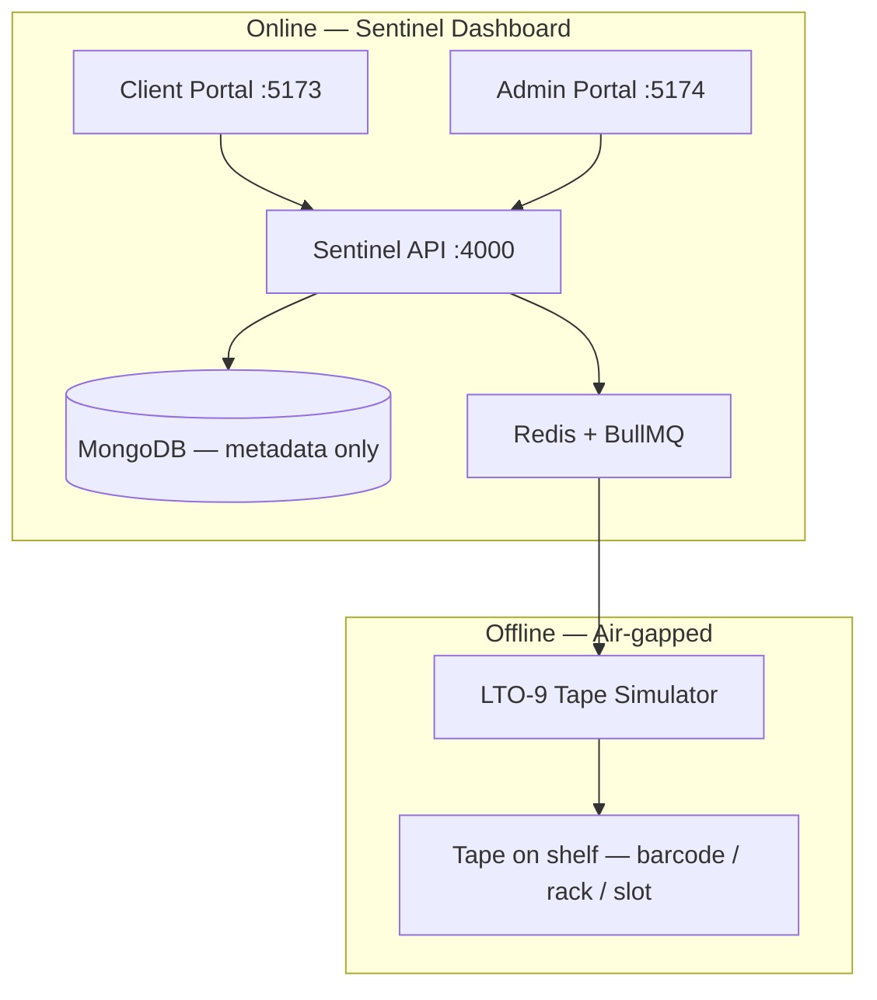
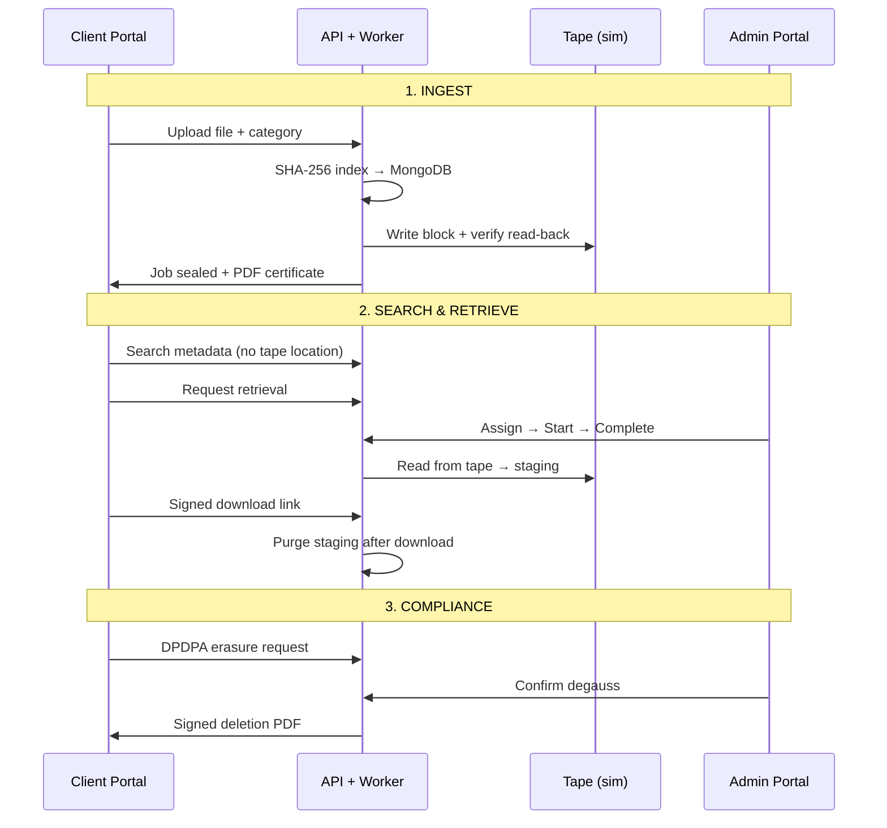

# BioVault Sentinel — MVP Flow (v0.1.0)

## System at a glance

## Core loop (what happens today)

## Security boundary

| Online | Never online |
|--------|----------------|
| Filename, category, checksum, job status | File bytes on tape |
| Client search results | Tape barcode / rack / slot (client API) |
| Time-limited download URL | Permanent file storage in MongoDB |

**SLA:** Retrieval due in **15 minutes** · Unassigned alert at **60 seconds**
