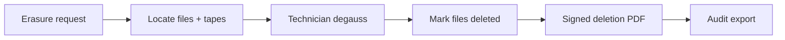

# Runbook: DPDPA Right to Erasure

**Audience:** Compliance officers (request), technicians (execution), ops admins (oversight)  
**Regulatory context:** DPDPA 2023 Right to Erasure — prove permanent deletion

## Prerequisites

- Client `compliance_officer` or `client_admin` authenticated
- Subject identifier and matching file metadata in index
- Technician access for tape degauss/destruction confirmation

## Flow overview



## Step 1 — Client submits erasure request

**Portal:** Client Portal → Compliance → New erasure request  
**API:** `POST /api/v1/erasure/requests`

```json
{
  "subjectId": "SUBJ-2024-0042",
  "reason": "DPDPA erasure request",
  "searchQuery": "patient-0042"
}
```

System locates matching `on_tape` files by filename/keyword tokens and records affected tape barcodes (admin-only).

## Step 2 — Admin reviews queue

**Portal:** Admin Portal → Erasure queue  
**API:** `GET /api/v1/admin/erasure/requests`

Review file count, subject ID, and tape locations before physical degauss.

## Step 3 — Execute degauss

1. Load each affected tape cartridge
2. Perform degauss or physical destruction per facility SOP
3. Record method in admin portal

**API:** `POST /api/v1/admin/erasure/requests/:id/complete`

```json
{
  "degaussMethod": "degauss",
  "notes": "LTO-9 degaussed per SOP-ERASE-01"
}
```

## Step 4 — System actions on complete

- File records → status `deleted`
- Tape fill adjusted; empty tapes marked for reuse
- Signed **deletion confirmation PDF** issued (`deletion_confirmation` certificate)
- `audit_events` row with subjectId, fileIds, technicianId

## Step 5 — Deliver certificate to client

**API:** `GET /api/v1/erasure/requests/:id/certificate/download`

Certificate includes: client name, subject ID, deleted filenames, timestamp, technician ID, digital signature.

## Step 6 — Regulator audit export

```bash
curl -s -b /tmp/compliance.cookies http://localhost:4000/api/v1/audit/export | jq
```

## Failure handling

| Symptom | Action |
|---------|--------|
| No matching files | Request stays `pending` with zero matches; verify search tokens |
| Partial tape wipe | Do not complete — re-run degauss; document in notes |
| Certificate missing | Re-issue via `POST .../certificate` |

## Out of scope (Phase 1 completion)

- Automated robotic tape picker
- Wet-lab / physical destruction witness workflow
- Multi-site tape federation
