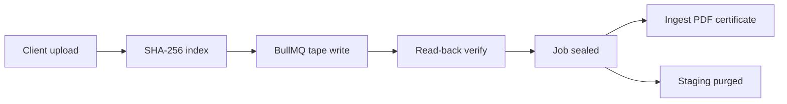

# Runbook: Ingest (upload → index → tape → verify → shelf)

**Audience:** Operations technicians, ingest workstation operators  
**SLA:** Normal volumes indexed and sealed within 24 hours (MVP: minutes via simulator)

## Prerequisites

- MongoDB + Redis running (`docker compose -f deploy/docker-compose.yml up -d mongo redis`)
- API + ingest worker running (`pnpm dev:api`)
- `STAGING_PATH` writable; `TAPE_ADAPTER=sim` for dev or `mtx|scalar` on production workstation
- Client user with `client_admin` role

## Flow overview



## Step 1 — Client upload

**Portal:** Client Portal → upload via API (multipart)  
**API:** `POST /api/v1/ingest/jobs` with `category` and `files` fields

```bash
curl -s -c /tmp/sentinel.cookies -X POST http://localhost:4000/api/v1/auth/login \
  -H 'Content-Type: application/json' \
  -d '{"email":"admin@acme.test","password":"ChangeMe123!"}'

curl -s -b /tmp/sentinel.cookies -X POST http://localhost:4000/api/v1/ingest/jobs \
  -F 'category=imaging' \
  -F 'files=@./fixture.bin;filename=scan-001.dcm'
```

**Expected:** HTTP 201 with `job.id`, status `queued` → `writing` → `verifying` → `sealed`

## Step 2 — Monitor job

```bash
curl -s -b /tmp/sentinel.cookies "http://localhost:4000/api/v1/ingest/jobs/$JOB_ID" | jq
```

| Status | Meaning |
|--------|---------|
| `queued` | Waiting for worker |
| `writing` | Tape sim write in progress |
| `verifying` | SHA-256 read-back |
| `sealed` | Success — tape marked `live`, staging purged |
| `failed` | Check worker logs; do not mark tape live |

## Step 3 — Verify tape catalog (admin only)

```bash
curl -s -b /tmp/admin.cookies http://localhost:4000/api/v1/admin/tapes | jq
```

Confirm barcode, rack, slot, fill %, health score updated. **Never expose barcode/rack/slot to client APIs.**

## Step 4 — Ingest confirmation report

```bash
curl -s -b /tmp/sentinel.cookies "http://localhost:4000/api/v1/ingest/jobs/$JOB_ID/report" | jq
```

## Step 5 — Issue signed PDF certificate

Auto-issued on seal; manual re-issue:

```bash
curl -s -b /tmp/sentinel.cookies -X POST \
  "http://localhost:4000/api/v1/ingest/jobs/$JOB_ID/certificate" | jq

curl -s -b /tmp/sentinel.cookies -o ingest-cert.pdf \
  "http://localhost:4000/api/v1/ingest/jobs/$JOB_ID/certificate/download"
```

## Failure handling

| Symptom | Action |
|---------|--------|
| Checksum mismatch on verify | Job stays `failed`; re-run ingest with new job; do not reuse tape block |
| Worker not processing | Check Redis connectivity; restart API (workers co-located) |
| Staging disk full | Purge completed ingest staging; expand `STAGING_PATH` volume |
| Tape full | Allocate new empty tape in admin inventory; re-queue job |

## Audit

Every upload and seal appends to `audit_events` with userId and IP. Export via `GET /api/v1/admin/audit/export`.

## Production notes (SFTP)

Production SFTP ingest uses the same pipeline after files land in `STAGING_PATH/sftp-inbox/`. MVP uses HTTP multipart only; SFTP watcher is Phase 1 completion backlog.
