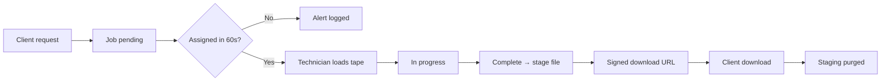

# Runbook: Retrieval (15-minute SLA, staging link, purge)

**Audience:** Operations technicians, ops admins  
**SLA:** `dueAt = createdAt + 15 minutes`; alert if unassigned > 60 seconds

## Prerequisites

- File status `on_tape` with valid `file_locations` entry
- Admin portal or API access as `technician` or `ops_admin`
- `STAGING_PATH` writable for transient copy

## Flow overview



## Step 1 — Client requests file

**Portal:** Client Portal → Search → Request retrieval  
**API:** `POST /api/v1/retrieval/jobs` with `{ "fileId": "..." }`

Only `client_admin` and `compliance_officer` may create requests.

## Step 2 — Monitor queue (admin)

**Portal:** Admin Portal → Retrieval queue (5s auto-refresh)  
**API:**

```bash
curl -s -b /tmp/admin.cookies http://localhost:4000/api/v1/admin/jobs | jq
```

Watch `slaRemainingSeconds` and `slaOverdue`. Overdue jobs appear with red border in admin UI.

## Step 3 — Technician workflow

| Action | API | Portal button |
|--------|-----|---------------|
| Assign to self | `PATCH /admin/jobs/:id` `{ "status": "assigned" }` | Assign |
| Start work | `PATCH` `{ "status": "in_progress" }` | Start |
| Complete | `POST /admin/jobs/:id/complete` | Complete |

On assign/start, admin UI shows **tape barcode, rack, slot** from `file_locations` — use this to locate the cartridge.

## Step 4 — Complete retrieval

`POST /admin/jobs/:id/complete`:

1. Reads file block from tape sim (`STAGING_PATH/tape-sim/`)
2. Writes transient copy to `STAGING_PATH/retrieval/`
3. Issues HMAC-signed download token (default TTL 1 hour)
4. Sets job status `ready`
5. Records `retrieval.client_notified` (portal notification stub)

Admin response includes `stagedForClient: true` only — **no download URL**. Ops staff must not receive file bytes on their workstation.

## Step 5 — Client download

**Portal:** Client Portal → Retrieval jobs → **Download file** (authenticated fetch with client session)  
**API:** `GET /api/v1/retrieval/download?token=...` — **requires client login** and matching tenant

After successful download or TTL expiry, staging file is purged and job moves to `delivered` or `expired`.

## SLA escalation

| Timer | Trigger | MVP action |
|-------|---------|------------|
| 60s unassigned | BullMQ delayed job | Log + `audit_events` row (`retrieval.unassigned_alert`) |
| 15m overdue | `dueAt` passed | Highlight in admin UI; ops manual escalation |

## Failure handling

| Symptom | Action |
|---------|--------|
| Tape read error | Mark job `failed`; check tape health; initiate re-copy if amber/red |
| Download 404 | Token expired — complete job again or client re-requests |
| Staging not purged | Run manual purge under `STAGING_PATH/retrieval/`; check worker logs |

## Security reminders

- Client APIs never return tape barcode, rack, or slot
- Download tokens are single-use and time-limited
- No file bytes in MongoDB or API memory beyond transient streams
